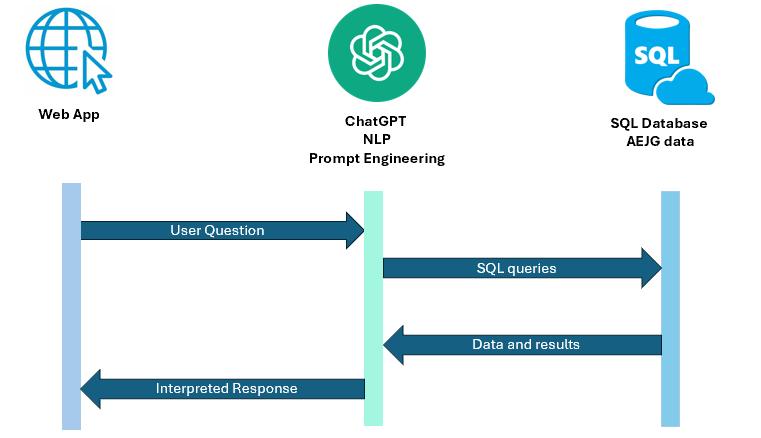

# AEJG Data Chat Bot

Chat with Azure OpenAI to analysis [AEJG](https://americanequity.org/index.html) SQL data

### Introduction

foobar




### Environment setup

1. rename .env.example file to .env and fill in all required endpoints and keys
2. install all required packages

```
pip install -r requirements.txt
```

3. run app

```
flask run
```

4. localhost default at [http://127.0.0.1:5000](http://127.0.0.1:5000)

### Next steps
 1. Need better prompt to describe the data schema to openai
 2. Investigate [Langchain](https://github.com/langchain-ai/langchain)(?)
